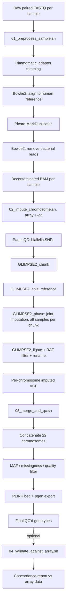

# GLIMPSE2 Genotype Imputation for Metagenomic Samples (Low Path WGS data Extracted from Metagenomic Samples)

A SLURM-based pipeline for imputing human host genotypes from low-coverage
shotgun metagenomic sequencing data (e.g. oral or vaginal microbiome
samples), using [GLIMPSE2](https://odelaneau.github.io/GLIMPSE/) for joint
genotype imputation against a public reference panel.

Developed and validated on the LLNEXT cohort at UMCG / University of
Groningen. GLIMPSE2 achieved ~98.8% genotype concordance against array data
at 0.5–7x host coverage, substantially outperforming GATK+Beagle (~87%) and
bcftools+Beagle (~86%) on the same samples.

## Why this exists

Shotgun metagenomic sequencing (oral, vaginal, gut, etc.) captures a small
fraction of human host DNA alongside the microbial signal — often at very
low, uneven coverage. This pipeline recovers usable host genotype calls
from that host fraction by:

1. Aligning reads to the human reference and removing microbial
   contamination.
2. Jointly imputing all samples together against a public reference panel
   with GLIMPSE2, which is specifically designed for low-coverage,
   sequencing-based genotype imputation (as opposed to array-based
   imputation tools like Beagle/Minimac, which assume much higher-confidence
   input genotypes).
3. Producing standard VCF / PLINK output ready for downstream GWAS,
   ancestry, or relatedness analyses.

## Pipeline overview



## Requirements

- SLURM cluster with `regularmedium` / `regularlong`-style partitions (adjust
  `#SBATCH` directives in `scripts/` to your cluster's partition names)
- Conda/Miniconda with two environments:
  - one with `trimmomatic`, `bowtie2`, `picard`, `samtools`
  - one with `bcftools` (with the `+fill-tags` plugin available), `plink2`
- [GLIMPSE2](https://github.com/odelaneau/GLIMPSE) static binaries
  (`GLIMPSE2_chunk`, `GLIMPSE2_split_reference`, `GLIMPSE2_phase`,
  `GLIMPSE2_ligate`)
- A public reference panel in GRCh38, per-chromosome VCF
  (e.g. 1000 Genomes + HGDP high-coverage panel — see
  [GLIMPSE2's reference panel documentation](https://odelaneau.github.io/GLIMPSE/docs/tutorials/getting_started))
- GLIMPSE2 genetic maps (b38) for each chromosome
- Bowtie2 indices for the human reference genome and a bacterial reference
  database (e.g. RefSeq bacterial genomes) for decontamination

## Quick start

```bash
git clone https://github.com/<your-username>/GLIMPSE2-metagenomic-imputation.git
cd GLIMPSE2-metagenomic-imputation

cp config/config.example.sh config/config.sh
# edit config/config.sh with your cluster's paths

# Stage 1: preprocess every sample in a list (one sample ID per line)
bash submit/submit_all_samples.sh my_sample_list.txt

# Stage 2: once ALL samples have finished Stage 1, impute all 22 chromosomes
sbatch --array=1-22 scripts/02_impute_chromosome.sh

# Stage 3: once all 22 chromosomes are done
sbatch scripts/03_merge_and_qc.sh

# Stage 4 (optional): validate against array genotypes for a subset of samples
bash scripts/04_validate_against_array.sh \
    output/07_postqc/all_chr_imputed_QC.vcf.gz \
    output/validation/run1 run1
```

Or submit the whole chain at once with correct SLURM dependencies:
```bash
bash submit/run_full_pipeline.sh my_sample_list.txt
```

See [`docs/USAGE.md`](docs/USAGE.md) for a detailed walkthrough of each
stage, output layout, and QC thresholds, and
[`docs/TROUBLESHOOTING.md`](docs/TROUBLESHOOTING.md) for solutions to
issues that came up repeatedly during development — most importantly, what
to do if you change your sample set partway through a run.

## Repository layout

```
config/           Central configuration (copy config.example.sh -> config.sh)
scripts/          The four pipeline stages + shared helper library
scripts/lib/      Shared bash functions (checkpointing, logging, validation)
submit/           Convenience wrappers for submitting jobs
docs/             Detailed usage and troubleshooting guides
```

## Resuming after failure

Every stage is checkpoint-based and safe to re-run: completed steps
(per-sample for Stage 1, per-chromosome for Stage 2, per-pipeline-stage for
Stage 3) are skipped automatically. See `docs/USAGE.md#resuming` for
details, and `docs/TROUBLESHOOTING.md` if you've changed inputs (sample
list, reference panel) between runs of the same chromosome.

## Citation

If you use this pipeline, please cite GLIMPSE2:

> Rubinacci, S., Hofmeister, R.J., Sousa da Mota, B., Delaneau, O. (2023).
> Imputation of low-coverage sequencing data from 150,119 UK Biobank genomes.
> *Nature Genetics*, 55, 1088–1090.


## License

[MIT](LICENSE)

## Author

Amin Haghparast
